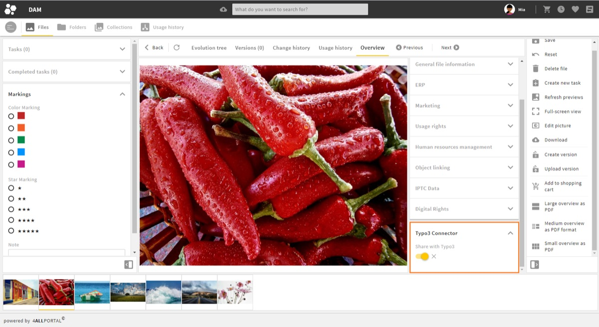

<div align="center">


# 4ALLPORTAL TYPO3 Extension

[](https://packagist.org/packages/fourallportal/fourallportal-typo3-extension)
[](https://extensions.typo3.org/extension/fourallportal_typo3_extension)
[](https://extensions.typo3.org/extension/fourallportal_typo3_extension)
[](LICENSE)

</div>

Share media from your [4ALLPORTAL](https://www.4allportal.com) DAM directly with your TYPO3
website: this extension is the TYPO3-side counterpart of the
[4ALLPORTAL TYPO3 Connector](https://docs.4allportal.com/4allportal-typo3-connector/latest/).
Assets shared in 4ALLPORTAL are pushed into the TYPO3 file abstraction layer (FAL) and kept
in sync - including renames, moves, metadata updates and deletions.



## What it does

The extension exposes a small JSON REST API under `/api` that the 4ALLPORTAL connector uses to:

- upload files into a configurable storage and folder path
- read file information
- rename, move and delete files (including cleanup of emptied folders)
- update file metadata (title, description, alternative, keywords, copyright)

Access is restricted to authenticated TYPO3 frontend users via short-lived bearer tokens.

## API

| Method | Route                     | Purpose                                              |
|--------|---------------------------|------------------------------------------------------|
| POST   | `/api/auth`               | Authenticate a frontend user, returns a bearer token |
| POST   | `/api/files`              | Upload a file (multipart)                            |
| GET    | `/api/files/{uid}`        | Get file information                                 |
| PUT    | `/api/files/{uid}`        | Update file metadata                                 |
| DELETE | `/api/files/{uid}`        | Delete a file                                        |
| POST   | `/api/files/{uid}/rename` | Rename a file                                        |
| POST   | `/api/files/{uid}/move`   | Move a file                                          |

All routes except `/api/auth` require an `Authorization: Bearer <token>` header.

## Installation

```bash
composer require fourallportal/fourallportal-typo3-extension
```

Also available in
the [TYPO3 Extension Repository](https://extensions.typo3.org/extension/fourallportal_typo3_extension)
as `fourallportal_typo3_extension`.

The API requires at least one frontend user (`fe_users` record) whose credentials are
configured in the 4ALLPORTAL connector.

## Documentation

Full installation and configuration guides (including the 4ALLPORTAL side: connector setup,
field mapping, download profiles and sharing triggers) are available in the
[official 4ALLPORTAL TYPO3 Connector documentation](https://docs.4allportal.com/4allportal-typo3-connector/latest/).

## Compatibility

| Extension | TYPO3     | PHP                    |
|-----------|-----------|------------------------|
| 2.x       | 13.4 / 14 | >= 8.2                 |
| 1.x       | 13        | per TYPO3 requirements |

Version 1.x relied on the third-party extension `nng/nnrestapi`; since 2.0 the extension is
dependency-free apart from TYPO3 itself.

## License

[MIT](LICENSE)
